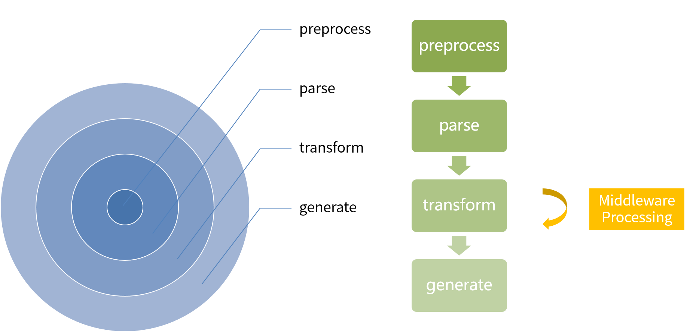
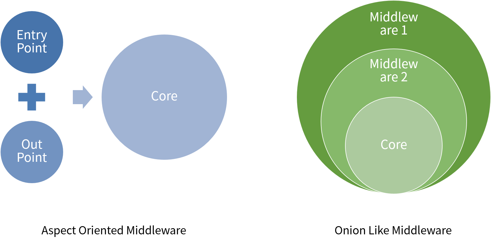

<p align="center"><a href="https://github.com/veeui/vee-testus#readme" target="_blank"></a></p>

<h2 align="center">TestUS</h2>

## Introduction

> A Test Kit for Vee

[testus](https://github.com/veeui/vee-testus#readme) is a Test Kit in Front End, which can help Developers to TEST your own projects. We concern multiple kinds of tests, such as Unit Test, Integration Test and E2E Test (UI Test), which can cover most of your test case for Front End.

## Principle

The overall architectural thinking is to use the idea of functional programming for modular construction. The overall process includes four stages: `preprocess`, `parse`, `transform`, and `generate`. Through the scaffolding method, the user-configured testus.config.js file content is parsed, transformed, and generated.

Finally, a composite construction function is exposed through compositional function programming, that is, exporting a result similar to `f(g(h(e(x))))`. This can be elegantly written with the `compose` function.



Regarding technology selection, TestUS adopts an intermediate processing solution with an extended application plugin configuration. Unlike the backend middleware that provides upstream and downstream solutions, the frontend middleware essentially serves as a caller. Common middleware processing methods include aspect-oriented middleware, also known as serial middleware, and onion-like middleware.

TestUS implements the middleware scheduling scheme using an aspect-oriented approach. Unlike the sophisticated design of `Redux` middleware using the `Context` context, TestUS primarily provides users with extensions through aspects without affecting the core business logic.



## Feature

1. Support parse notation to get what you wanna test;

2. Support ``testus.config.js`` to customize your own options;

3. Support vscode icons for ``testus.config.js`` to beautify your IDE;

4. Support cli plugin to perform your Develop Experience. Officially, we only support plugin for our own cli but you can customize your plugin which we expose a plugin api.

## Installation

> npm install testus

## Quick Start

In your root directory, you'd better to create a `testus.config.js`. If we can't find `testus.config.js` in your root directory, we set a default configuration:

```js
module.exports = {
    entry: {
        // path which you want to observe based to the root directory
        dirPath: '',
        // what types file you want to watch
        extFiles: ['js'],
        // file or directory which you want to ignore
        excludes: [],
    },
    output: {
        // path which you want to export based to the root directory
        dirPath: 'tests',
        // you want to generate a test file whose middle name you want to define
        middleName: 'spec',
    },
    options: {
        // test libraries you want to test, which supports jest, jasmine and karma right now
        libName: 'jest',
        // test libraries' config, such as jest.config.js, jasmine.config.json and karma.conf.js
        libConfig: {

        }
    },
    // plugin should be a function, which must return a next(ctx) in your plugin params, such as: (ctx, next) => next(ctx)
    plugins: [

    ]
}
```

## Notation

If you want to generate a test file related to your code, you'd better to write a notation in your code. We cite an instance like this:

```js
/**
 * @testus 
 * @name sum
 * @description test sum function
 * @param a 1
 * @param b 2
 * @return 3
 * @testus
 */
const sum = (a,b) => a+b;

/**
 * @end
 */
module.exports = {
    sum
}
```

we can parse `@testus` from your code, which you must use `@testus` closing your notation that can be filtered in our platform. More importantly, you have to write an `@end` to let us know what you want to export, which now only support Common JS Module.

|Notation|Closing|Description|
|:-:|:-:|:-:|
|@testus|yes|offer a scope that need to parse|
|@name|no|an export refer which you want to test|
|@description|no|an description which you want to describe|
|@param|no|a param which you want to input in your function or sth|
|@return|no|a return which you want to return in your function or sth|
|@end|no|offer a `module.exports`|


## Plugins

|Project|Description|
|:-:|:-:|
|testus-plugin-jest |jest plugin|
|testus-plugin-karma |karma plugin|
|testus-plugin-jasmine |jasmine plugin|

## Document

- [The Practice of building TestUS In the Front End](https://vleedesigntheory.github.io/tech/front/testus20220420.html)
- [Config](./docs/config.md)
- [Core](./docs/core.md)
- [Testus-Plugin-Jasmine](./docs/testus-plugin-jasmine.md)
- [Testus-Plugin-Jest](./docs/testus-plugin-jest.md)
- [Testus-Plugin-Karma](./docs/testus-plugin-karma.md)

## License

[MIT](http://opensource.org/license/MIT)

Copyright (c) Vee
